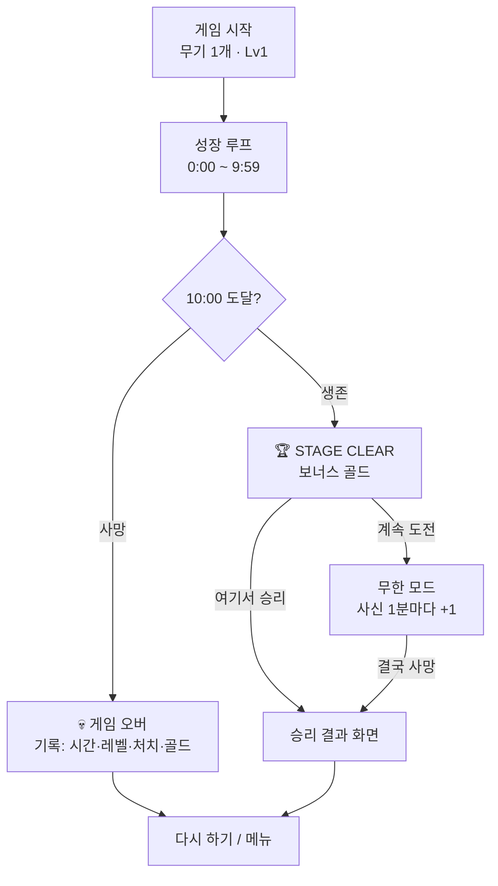
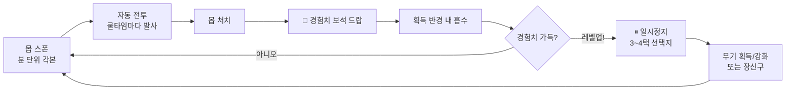

# Vampire Survivors 전투 밸런스 구조 분석

> 출처: 나무위키 Vampire Survivors 본문 + 능력치 + 스테이지(웨이브) 문서 (2026-07 열람).
> 목적: 우리 Survivor 포팅(10분 런)의 밸런싱 참고.

## 1. 시간축 구조 — "각본이 짜인 30분"

VS의 난이도는 수식 하나로 흐르지 않는다. **1분 단위로 짜인 웨이브 각본**이 기본 골격이고,
그 위에 돌발 이벤트와 고정 데드라인이 얹힌다.

| 시간(광기의 숲 기준) | 내용 | 역할 |
|---|---|---|
| 0~1분 | 최약체 소수 스폰, 1분 첫 중간보스(상자) | 튜토리얼, 첫 당근 |
| ~9분 | 웨이브 교체(1분마다), 박쥐떼/유령떼 러시 | 리듬 형성, 경험치 사탕 |
| 9분 | 거대 박쥐(고체력·넉백저항) | 1차 커트라인(화력 검사) |
| 10분 | **진화 상자 개방** | 최대 파워스파이크 개방 |
| 11분 | 적 밀도 급증 + 아르카나 상자 | 2차 커트라인 |
| 16~24분 | 느리고 튼튼한 몹 위주, 스폰 감소 | 의도된 소강(빌드 완성 구간) |
| 25분 | **스테이지 보스** (처치=하이퍼 해금) | 1차 목표, 최종 시험 |
| 28~29분 | 최대 물량 웨이브 | 완성된 빌드의 파워 판타지 무대 |
| 30분 | **사신(Reaper)** 등장 | 강제 종료 데드라인 |

핵심 규칙:
- 웨이브는 n:00~n:59 단위로 정의되고, **이미 나온 몹은 사라지지 않는다** (누적 압박).
- 사신: 접촉 65,535 피해(즉사), 체력 655,350×플레이어 레벨, 피격 시 순간이동,
  **1분마다 1마리씩 추가** → 어떤 빌드라도 결국 끝난다. 사신을 잡아도(황금알 드랍)
  '화이트 핸드'(무적)가 나와 강제 종료. → **런은 반드시 정점에서 끝난다.**
- 하드 모드는 배율 장난이 아니라 별도 보정(하이퍼: 이속+75~100%, 골드+50% 등
  스테이지별 상이) + 챌린지 맵은 분당 스케일(뼈의 대지: 적 체력 +0.3/분, 이속 +0.05/분).

### 스파이크 이벤트(맵별 고유 압박 기믹)
- **떼 러시(스웜)**: 체력 1짜리 박쥐/유령 수백 마리 직선 돌진 — 위협처럼 보이지만
  사실 경험치 보너스. 긴장→보상의 롤러코스터.
- **포위(플라워 벽)**: 고체력·저속 링이 플레이어를 둘러쌈 — 화력이 아니라 **동선**을 검사.
- **자폭몹**(50 피해), **저격 포탑**, **슈팅스타 폭격**, 녹색 사신 '스토커'(즉사급 추적 2분) 등
  맵마다 1~3종의 고유 기믹으로 "이번 분은 뭐가 오지?"를 만든다.
- 중간보스는 정해진 분에 등장, **보물상자**를 드랍(진화 운반체).

## 2. 플레이어 파워 커브 — 곱연산 폭발

### 슬롯 구조
- 무기 6칸 + 장신구(패시브) 6칸. 무기는 레벨 8까지, 레벨업 선택지로 성장.
- **진화**: 만렙 무기 + 지정 장신구 보유 → 10분 이후 보물상자에서 진화(1회 대폭 강화).
  → 10~15분 사이에 런 최대의 파워스파이크가 오도록 상자 개방 시점으로 게이트.

### 능력치(장신구/강화)가 전부 곱연산
| 스탯 | 효과 | 상한 | 비고 |
|---|---|---|---|
| 쿨타임 | 발사 간격 감소 | -90% | **합연산이라 DPS 효율 1위** — 최우선 |
| 투사체 수 | 모든 무기 +n발 | +10 | 기본 발수 적은 무기일수록 효율↑ |
| 피해량 | 곱연산 | +1000% | 기본 공격력 높은 무기와 시너지 |
| 공격범위/탄속/지속 | 곱연산 | +1000/500/500% | |
| 방어력 | 피해 -1/포인트 | (실질 50) | 잡몹 접촉을 0으로 만드는 문턱값 |
| 회복/자석/행운/성장 | 유지력·수급 | - | 행운=4번째 선택지·상자 3/5개 확률 |

- **저주(Curse)**: 적 수·체력·속도·스폰율 +% — 난이도를 올리는 대신 경험치 수급이 빨라지는
  **플레이어가 돌리는 난이도 다이얼**(리스크↔성장 교환).
- 레벨업 UI: 기본 3택(행운으로 4택) + **새로고침/건너뛰기/지우기** 횟수제 —
  RNG에 대한 통제권을 소모품으로 판다.

### 메타(런 밖) 성장
- 골드 → 영구 강화(피해+25%, 쿨타임-5%, 투사체+1, 부활 등, 풀업 ~24만 골드).
- 황금알: 사신 처치/암상인 — 무한 반복 영구 스탯. **죽어도 골드는 남는다** →
  패배가 다음 판의 가시적 성장으로 전환(리텐션 코어).

## 3. 재미의 핵심 구조 (분석)

1. **교차하는 두 곡선**: 위협은 계단형(각본), 파워는 곱연산 지수형.
   - 초반: 위협>파워 — 카이팅과 한 발 한 발이 소중함 (긴장).
   - 10~15분: 진화로 곡선이 **역전** — "내가 강해졌다"가 체감되는 순간.
   - 후반: 파워≫위협 — 화면을 지우는 파워 판타지. 28~29분 물량은 위협이 아니라 **불꽃놀이**.
   - 30분: 사신이 신이 된 플레이어를 강제로 끝냄 — **정점에서 끊어서** 지루해지기 전에
     "한 판 더"로 전환. (뱀서라이크의 최중요 발명)
2. **30~60초 주기의 의사결정 인터럽트**: 레벨업 3~4택이 끊임없이 끼어들어
   조작(이동뿐)의 단조로움을 보완. 빌드 정체성 + 슬롯머신 심리.
3. **위장된 보상**: 떼 러시·저주·엘리트 등 "위협처럼 보이는 것"의 상당수가 실은 보상 가속.
4. **낮은 입력, 높은 출력**: 조작은 이동 하나(스킬 발동조차 자동) — 실력은
   동선/포지셔닝/빌드 지식으로 표현됨. 진입장벽↓ 숙련 천장↑.
5. **손실의 재활용**: 죽음→골드→영구강화→다음 판 체감 성장. 실패가 진행이 된다.

## 4. 우리 포팅(10분 런)에의 적용 포인트

현재 구현: 20초 단위 페이즈 스폰, 보스→보물상자(40초 쿨), 만렙+장신구 진화,
10분 사신, 스탯 13종, 레벨업 3~4택+새로고침/건너뛰기/지우기. → VS 골격은 이식됨.

적용 현황 (2026-07-25 반영):
1. ✅ **커트라인/소강의 리듬** — 10페이즈 각본(mob_manager.dart):
   0:30 램프업 → 3:00~3:40 약졸 스파이크 → 3:40 숨고르기 → 4:00 분보스 →
   5:00~7:00 소강(튼튼몹) → 7:00 재상승 → 8:00~9:30 최대 물량 → 9:30 피날레.
2. ✅ **스웜 이벤트** — 2:00부터 35초마다 체력1×60마리(20×3열) 직선 관통,
   expDrop 0.3 (경험치 사탕), 접촉피해 3, 수명 후 조용히 소멸.
3. ✅ **포위 이벤트** — 6:00 1회, 고체력(×5)·저속(16) 링 26마리 반경 560,
   수명 55초, 경고 배너.
4. ✅ **진화 게이트** — 보물상자는 4:00 이후 보스만 드랍 (첫 분보스 4:00 즉시 스폰).
5. ✅ **사신 강화** — 9:50 경고 배너("무언가 무시무시한 것이…"), 10:00부터 1분마다 +1.
6. ✅ **저주형 다이얼** — 장신구 '미치광이의 두개골'(💀, 최대 3랭크):
   랭크당 적 스폰 +25%·적 체력 +20%·경험치 +15% (리스크↔성장 교환).
7. ✅ **클리어 + 무한 모드** — 10:00 도달 시 STAGE CLEAR 팝업(+보너스 100🪙):
   "여기서 승리"(승리 결과 화면) 또는 "계속 도전"(사신 1분마다 추가되는 무한 기록전).
   이후 사망해도 승리 화면으로 표시 (VS: 사신에게 죽어도 클리어 인정).

## 5. 전투 플로우 (정리)

### 5-1. 런 전체 플로우 (한 판의 생애)

### 5-2. 성장 루프 (초 단위 — 게임의 심장)

- 이 루프가 30~60초에 한 번씩 "레벨업 인터럽트"를 만들어, 이동뿐인 조작의
  단조로움을 의사결정으로 보완한다. 루프가 돌수록 파워가 곱연산으로 커지고,
  각본은 계단식으로 위협을 올려 **긴장→해소 리듬**을 만든다.

### 5-3. 프레임 단위 전투 처리 (구현 관점)

1. **입력**: 이동만 (방향키/WASD/조이스틱). 공격 입력 없음.
2. **무기 타이머**: 무기별 쿨타임 = 기본 쿨타임 × 캐릭터 cooldown 스탯(빈 책),
   진화 시 추가 단축. 타이머 만료 → 발사.
3. **조준 규칙** (무기마다 다름): 화살=최근접 몹, 화염구/번개=무작위 몹,
   검=이동 방향, 채찍=좌우 고정, 방패=상시 궤도.
4. **피해 판정**: 피해 = 무기 기본치(레벨별) × might(시금치) × 진화 보정.
   치명타 = 무기 기본 치명률 × luck(클로버), 성공 시 ×2 + 노란 데미지 숫자.
5. **명중 방식 2종**: 투사체(dynamic)=명중 즉시 자기 소멸 /
   설치형(static)=몹마다 0.5초 피격 쿨다운 (원작 Survivor 방식 유지).
6. **넉백**: 무기별 넉백 값이 몹의 잔여 속도 벡터에 더해지고 감쇠.
7. **사망 처리**: 폭발 이펙트 → 확률 드랍(💎경험치/🪙골드/아이템) →
   보스면 보물상자(4분 게이트, 40초 쿨다운).
8. **흡수**: 보석·금화는 획득 반경(매혹구로 확장) 안에 들면 끌려온다.
   자석 아이템은 화면 전체 흡수.
9. **레벨업**: 경험치 가득 → 엔진 정지 → 선택지(행운으로 4번째 슬롯) →
   새로고침/건너뛰기/지우기로 RNG 통제 → 재개.

### 5-4. 위협 스케줄러 (분 단위 각본 + 이벤트)

| 채널 | 주기 | 내용 |
|---|---|---|
| 기본 스폰 | 페이즈별 gap | 10페이즈 각본 (워밍업→스파이크→소강→최대물량) |
| 스웜 러시 | 2:00부터 35초 | 체력1 ×60마리 직선 관통 (경험치 사탕) |
| 포위 이벤트 | 6:00 1회 | 고체력 링 26마리, 동선 검사 |
| 분보스 | 4:00 / 7:00 / 8:00~ | 처치 시 보물상자(진화) |
| 사신 | 9:50 예고, 10:00+ | 무적·즉사, 1분마다 +1 — 런의 데드라인 |
| 저주(선택) | 상시 | 💀 장신구로 스폰/체력↑ ↔ 경험치↑ |
